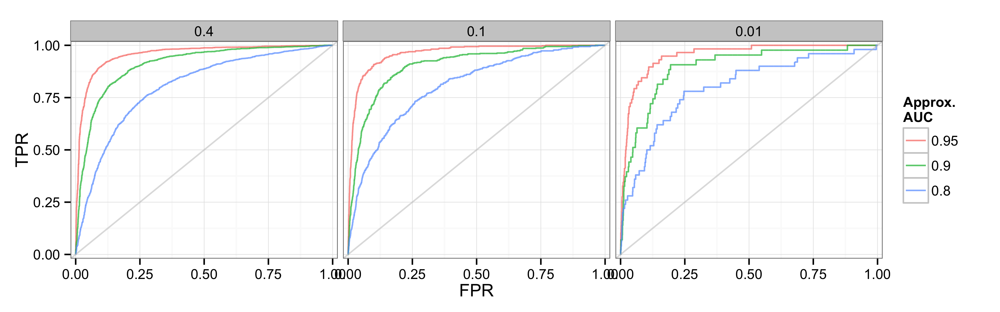
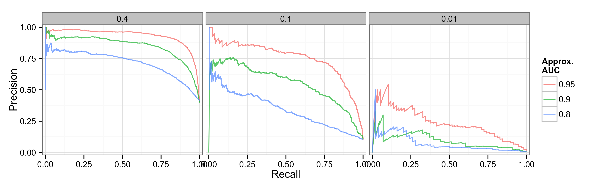

## Precision-recall curves

Precision recall curves are a cousin of the ROC curve. While ROC curves plot the tradeoff between recall and false positive rates, precision-recall curves plot precision against recall instead. This is better when modeling rare events--lots of 0's and few 1's. 

Because predicting 0's correctly is easy when they constitute the vast majority of observed outcomes, ROC curves overstate model performance for such data. The plots below show ROC curves for three models of three sets of fake data, each with a decreasing fraction of positive outcomes (0.4, 0.1, 0.01). All show that our model is great. 

Precision shows how many predicted positive cases were actually positive outcomes. It is not sensitive to the large number of negative outcomes we correctly predict. Here are PR curves for the same three models with the same three sets of fake data:

It is more obvious from these plots that the third model with rare events--0.01 fraction positive cases--has "room for development".

To get functions needed to plot a precision-recall curve and calculate the area under it (AUC-PR), check `auc-pr.r`.

[Related blog post](http://andybeger.com/2015/03/16/precision-recall-curves/)